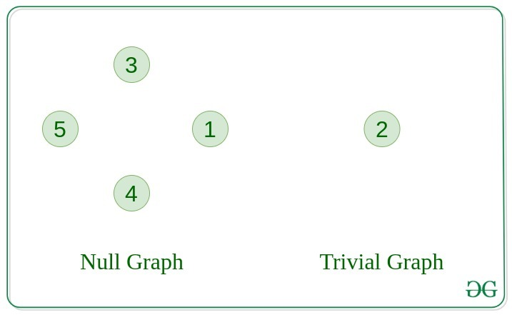
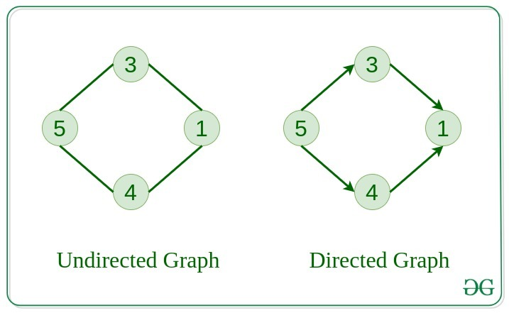
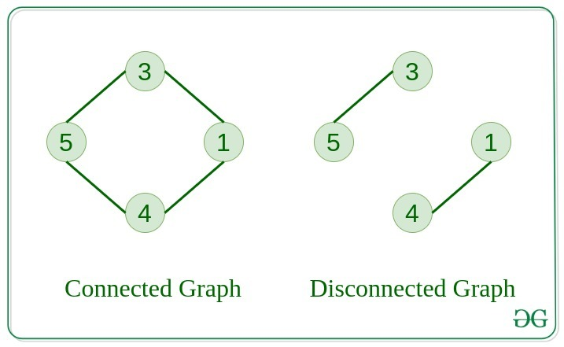
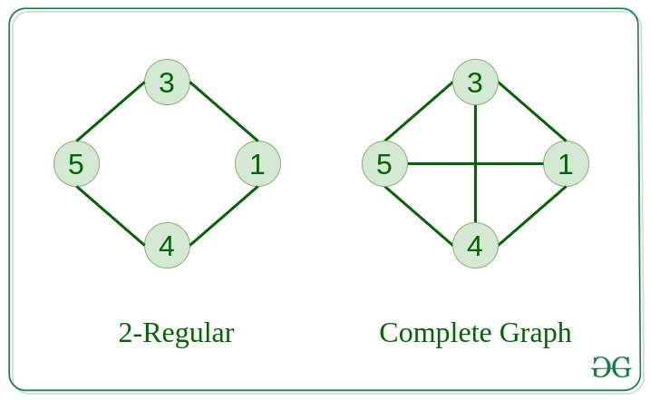
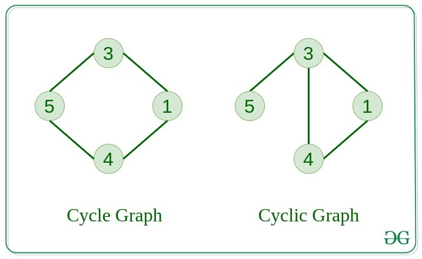
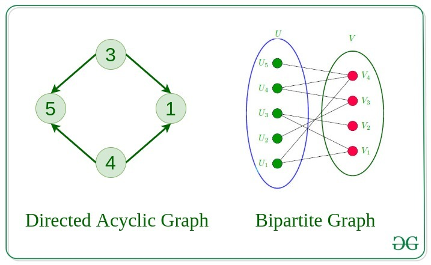
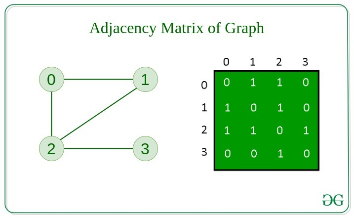
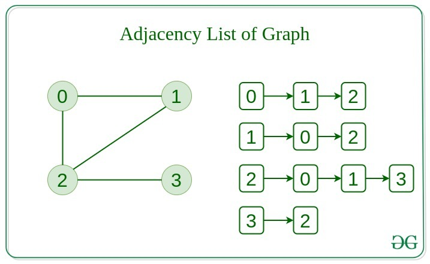

#Graphs
Graphs are non-linear data startuctures. vertexes and edges are main components of the graphs.


A graph with N vertexes can have N-1 number of graphs.


##Types Of Graph
####1. Null Graph
A graph is known as a null graph if there are no edges in the graph.

####2. Trivial Graph
Graph having only a single vertex, it is also the smallest graph possible.

 

####3. Undirected Graph
A graph in which edges do not have any direction. That is the nodes are unordered pairs in the definition of every edge. 

####4. Directed Graph
A graph in which edge has direction. That is the nodes are ordered pairs in the definition of every edge.



####5. Connected Graph
The graph in which from one node we can visit any other node in the graph is known as a connected graph. 

####6. Disconnected Graph
The graph in which at least one node is not reachable from a node is known as a disconnected graph.

####7. Regular Graph
The graph in which the degree of every vertex is equal to K is called K regular graph.

####8. Complete Graph
The graph in which from each node there is an edge to each other node.

.

####9. Cycle Graph
The graph in which the graph is a cycle in itself, the degree of each vertex is 2. 

####10. Cyclic Graph
A graph containing at least one cycle is known as a Cyclic graph.



####11. Directed Acyclic Graph
A Directed Graph that does not contain any cycle. 

####12. Bipartite Graph
A graph in which vertex can be divided into two sets such that vertex in each set does not contain any edge between them.



####13. Weighted Graph

 A graph in which the edges are already specified with suitable weight is known as a weighted graph. 
 Weighted graphs can be further classified as directed weighted graphs and undirected weighted graphs. 

##Representation of Graphs
There are two ways to store a graph:

- Adjacency Matrix
- Adjacency List

#####Adjucency Matrix: 
For the graph with N nodes, We need to create the matrix of size NxN with all 0's. To denote the edge between 2 vertices, udpate the value 1 at adjMat[v][u]. 


#####Adjucency List:
For the graph with N nodes, Create an array of size N, each index pointing to the List. Update the list with all the nodes connected to the respective node.



####Code to update the adjucency matrix.
```python
class AdjMatrix:
    def __init__(self,num_vertices:int)->None:
        """This class will create,remove, and print the nodes in adjucency matrix

        Args:
            num_vertices (int): number of vertices.
        """
        self.num_vertices=num_vertices
        self.matrix=[[0 for _ in range(self.num_vertices)] for _ in range(self.num_vertices)]
    
    def add_node(self,v:int,u:int)->None:
        """adds the node to the adjucency matrix

        Args:
            v (int): node_1
            u (int): node_2
        """
        if u<self.num_vertices and v<self.num_vertices:
            self.matrix[v][u]=1
            self.matrix[u][v]=1
    
    def remove_node(self,v:int,u:int)->None:
        """removes the node the adjucency matrix

        Args:
            v (int): node_1
            u (int): node_2
        """ 
        if u<self.num_vertices and v<=self.num_vertices:
            self.matrix[v][u]=0
            self.matrix[u][v]=0
    
    def print_adj_matrix(self):
        for row in self.matrix:
            print(row)

def main():
    graph=AdjMatrix(5)
    graph.add_node(0,1)
    graph.add_node(0,2)
    graph.add_node(1,2)
    graph.add_node(2,0)
    graph.add_node(2,3)
    graph.remove_node(2,3)
    graph.print_adj_matrix()

if __name__=="__main__":
    main()
```


#### Code to update the adjucency list.
```python
class adjList:
    def __init__(self,num_vertices:int)->None:
        self.num_vertices=num_vertices
        self.adjArray=[[] for _ in range(self.num_vertices)]
    
    def add_node(self,v:int,u:int)->None:
        """Adds the node to the adjucency list

        Args:
            v (int): node_1
            u (int): node_2
        """
        if v<self.num_vertices and u<self.num_vertices:
            # if u not in self.adjArray[v]:
            self.adjArray[v].append(u)
            # if v not in self.adjArray[u]:
            self.adjArray[u].append(v)
    
    def remove_node(self,v:int,u:int)->None:
        """removes the node from adjucency list

        Args:
            v (int): node_1
            u (int): none_2
        """
        if v<self.num_vertices and u<self.num_vertices:
            self.adjArray[v].remove(u)
            self.adjArray[u].remove(v)
    

    def print_adj_list(self)->None:
        """Prints the adjucency array
        """
        for id,node in enumerate(self.adjArray):
            if len(node):
                node.append('null')
            else:
                node=['null']
            print(f"{id}->{'->'.join(list(map(lambda x: str(x),node)))}")


def main():
    graph=adjList(5)
    graph.add_node(0,1)
    graph.add_node(0,2)
    graph.add_node(1,2)
    graph.add_node(2,0)
    graph.add_node(2,3)
    graph.remove_node(2,3)
    graph.print_adj_list()


if __name__=="__main__":
    main()
```